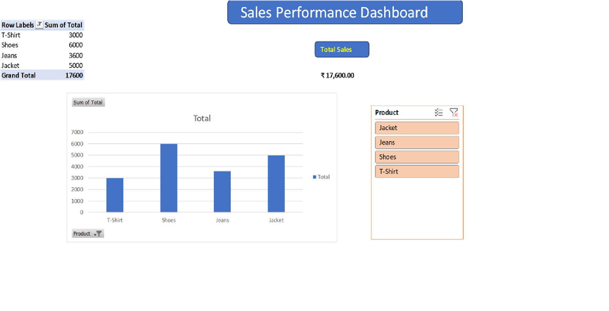

# 📊 Excel Sales Performance Dashboard

This project is an **Interactive Sales Dashboard** created using **Microsoft Excel**.  
It helps visualize sales data using:

### 🔧 Tools & Features Used
- Pivot Table
- Pivot Chart
- Slicer (Product Filter)
- KPI Metric (Total Sales Value)

### 📈 Key Insight
**Total Sales:** ₹17,600

### 📌 Dashboard Preview

### 📂 Files in this Repository
| File | Description |
|------|-------------|
| `Sales_Dashboard1.xlsx` | Main Excel dashboard file |
| `Sales_Dashboard1.png` | Dashboard screenshot image |

### 🎯 Skills Gained
- Data Cleaning in Excel
- Pivot Table & Chart Reporting
- Interactive Dashboard Building
- Data Visualization

---

### 🤝 Connect With Me
🔗 [LinkedIn Profile](https://www.linkedin.com/in/yamuna-peddi-305203378/)

### 📌 LinkedIn Post About This Project
🔗 https://www.linkedin.com/posts/yamuna-peddi-305203378_excel-dashboard-dataanalytics-activity-7396480166895591424-YZ7T

